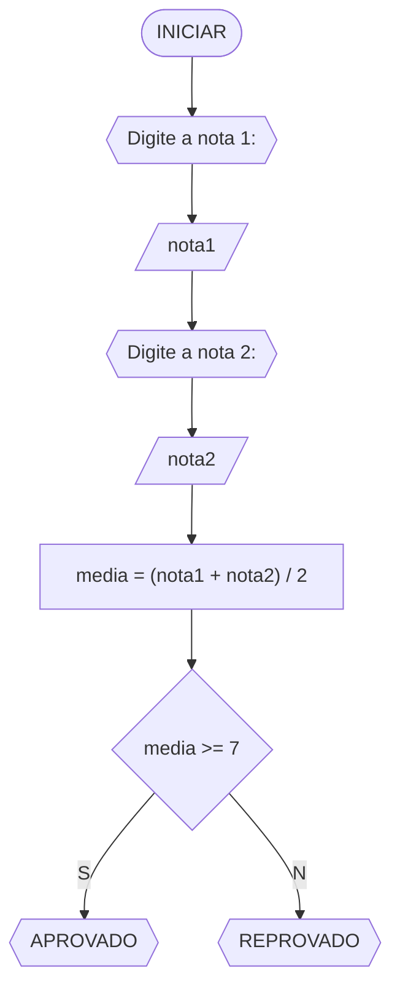
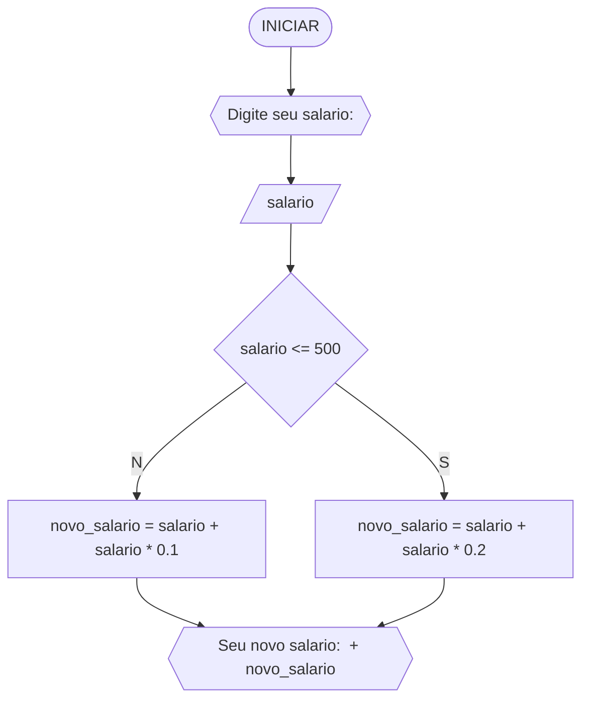
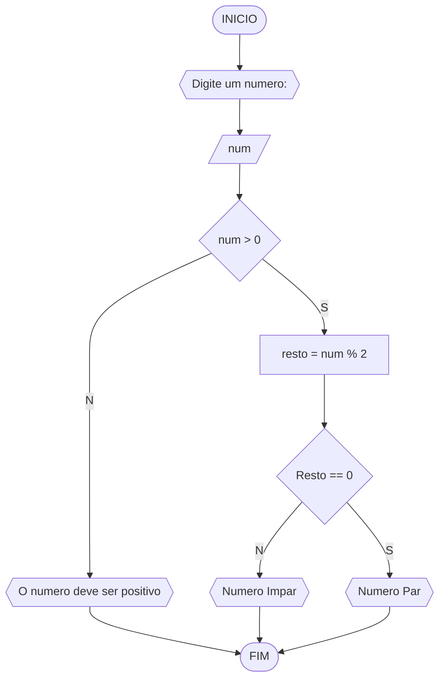
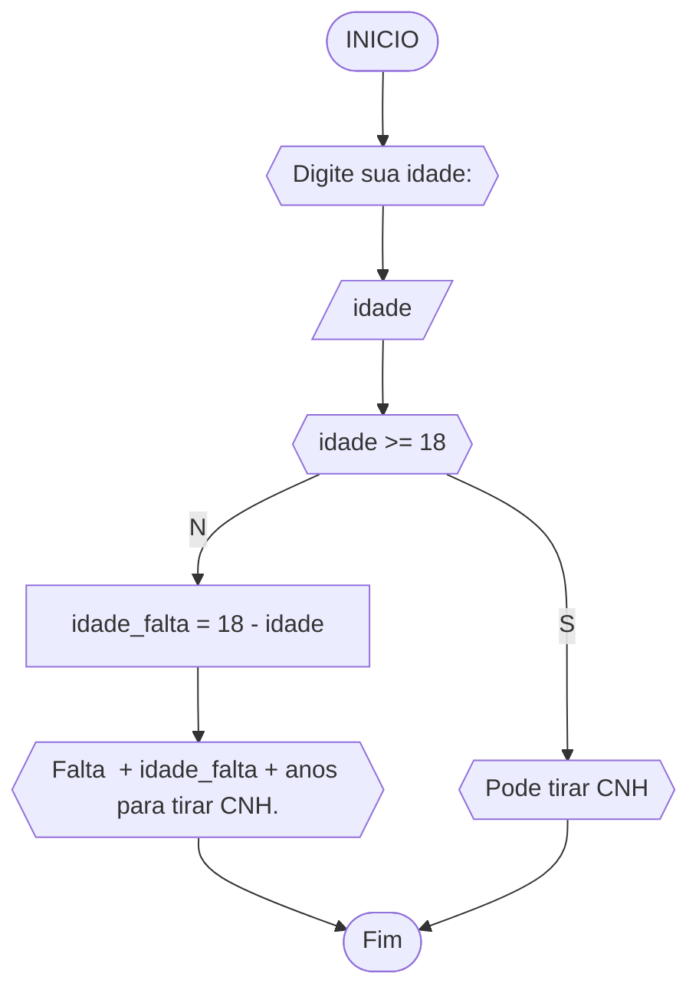

# Unifor
**Discuplina** Raciocínio Lógico algorítmico<br>
**Orientador** Prof.Ricardo Carubbi

## Lista 1 de exercícios

### Exercício 1
Represente, em fluxograma e pseudocódigo, um algoritmo para calcular a média aritmética entre duas notas de um aluno e mostrar sua situação, que pode ser aprovado ou reprovado;

### Fluxograma

###Pseudocódigo
```
DECLARE nota1, nota2, media FLUTUANTE
ESCREVER "Digite a nota 1:" 
LEIA nota1
ESCREVER "Digite a nota 2:" 
LEIA nota2
media = (nota1 + nota2 / 2)
SE media >= 7 ENTAO
	ESCREVER("APROVADO")
SENAO
	ESCREVER("REPROVADO")
```
### Exercício 2
Represente, em fluxograma e pseudocódigo, um algoritmo para calcular o novo salário de um funcionário. Sabe-se que os funcionários que recebem atualmente salário de até R$ 500 terão aumento de 20%; os demais terão aumento de 10%.

###Fluxograma

###Pseudocódigo
```
DECLARAR salario, novo_salario FLUTUANTE
ESCREVER "Digite seu salario: "
LEIA salario
SE salario <= 500 ENTAO
	novo_salario = salario + salario * 0.2
	ESCREVER "Seu novo salario: " + novo_salario"
SENAO
	novo_salario = salario + salario * 0.1
	ESCREVER "Seu novo salario: " + novo_salario"
FIM
```

### Exercício 3
Represente, em fluxograma e pseudocódigo, um algoritmo para determinar se um número inteiro e positivo é par ou impar.

#### Fluxograma


###Pseudocódigo
```
DECLARE num, resto INTEIRO
ESCREVA "Digite um numero: "
LEIA num
SE num > 0 ENTAO
	resto = num % 2
	SE resto == 0 ENTAO
		ESCREVA "Numero Par"
	SENAO
		ESCREVA "Numero Impar"
SENAO
	ESCREVA "O numero deve ser positivo"
FIM
```

### Exercício 4
Represente, em fluxograma e pseudocódigo, um algoritmo que, a partir da idade do candidato(a), determinar se pode ou não tirar a CNH. Caso não atender a restrição de idade, calcular quantos anos faltam para o candidato estar apto.

### Fluxograma

###Pseudocódigo
```
DECLARAR idade, idade_falta INTEIRO
ESCREVER "Digite sua idade: "
LEIA idade
SE idade >= 18 ENTAO
	ESCREVER "Pode tirar CNH"
SENAO
	idade_falta = 18 - idade
	ESCREVER "Falta " + idade_falta + " anos para tirar CNH"
FIM
```
