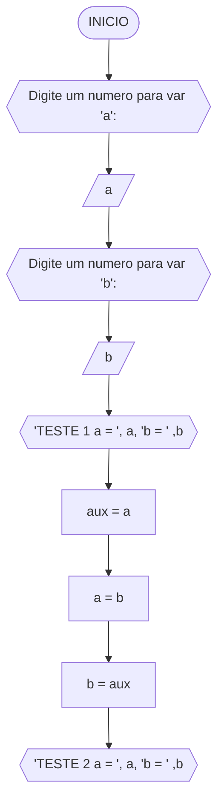
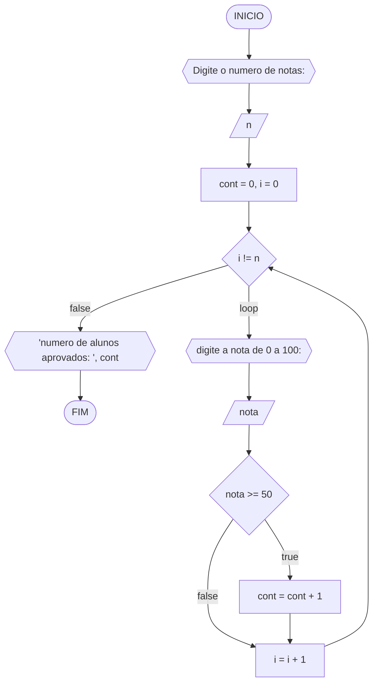
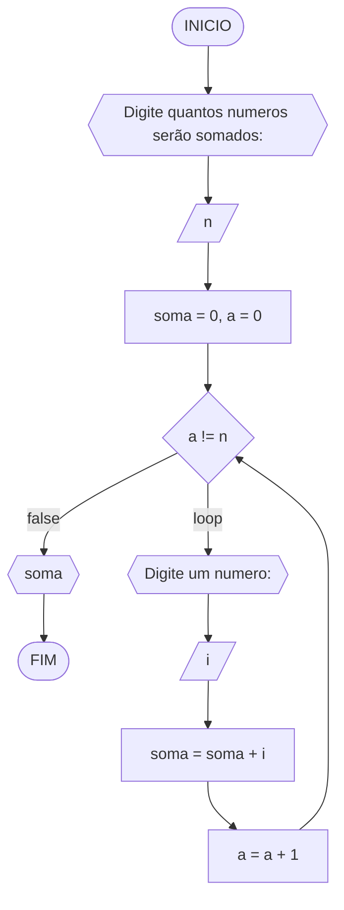
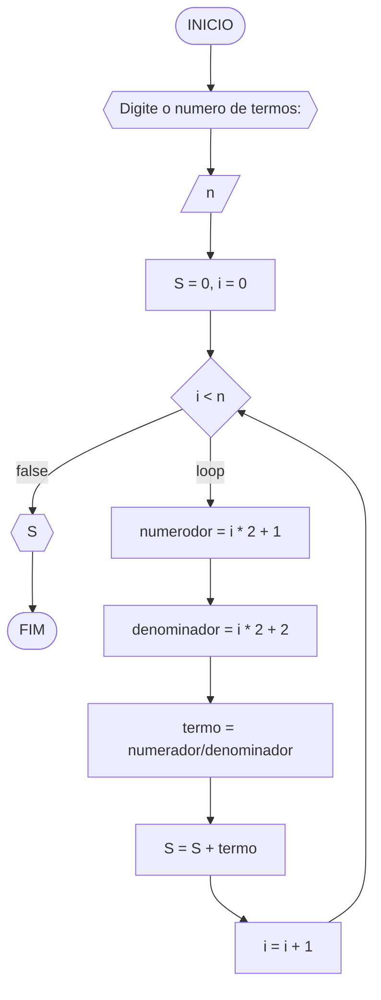
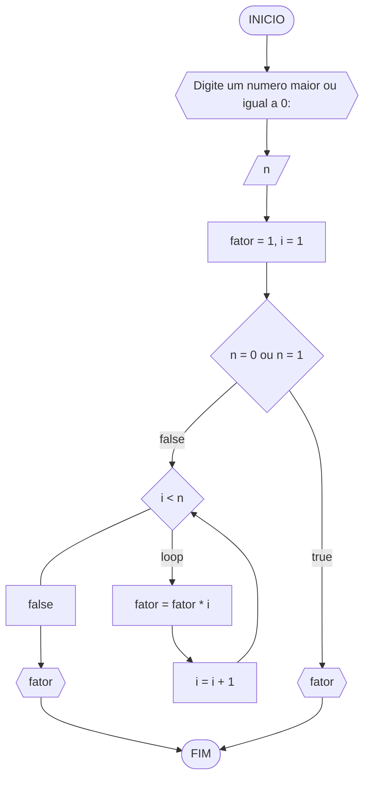
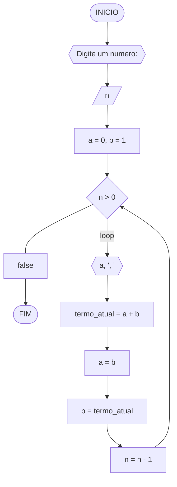
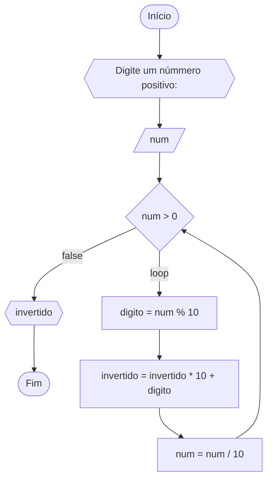

**Curso:** preencha com seus dados <br>
**Disciplina:** preencha com seus dados <br>
**Código/Turma:** preencha com seus dados <br>
**Professor:** Ricardo Carubbi <br>
**Data:** preencha com a data de envio <br>
**Aluno(a):** preencha com seus dados <br>
**Matrícula:** preencha com seus dados <br>

**1a chamada (Sim/Não):** preencha com a opção correta <br>
**2a chamada (Sim/Não):** preencha com a opção correta

# Avaliação Diagnóstica 1

## Normas e exigências

Avaliação diagnóstica (**AD**) consiste em exercícios ou projetos desenvolvidos em grupo ao longo da disciplina. <br>
A primeira avaliação diagnóstica (**AD1**) será composta por exercícios e equivale a 30% da nota da primeira avaliação (**AV1**).

Segue abaixo a expressão para o cálculo da **AV1**, sendo sendo **AF1** equivale a primeira avaliação formativa e **AD1**, a primeira avaliação diagnóstica.

$$AV_1 = AF_1 \times 0,30 + AD_1 \times 0,70$$

A **AD1** é formada pela entrega dos exercícios (**EX1**) na data prevista e apresentação (**AP1**) de um dos exercícios escolhido pelo professor.
Segue abaixo a expressão para o cálculo da **AD1**.

$$AD_1 = (EX1_1 + AP_1)/2 $$

A **EX1** é avaliada mediante a **correção dos exercícios**, sendo a avaliação no intervalo de 0% (não atende a questão), 50% (atende parcialmente) e 100% (atende em sua totalidade).
Por exemplo, se o exercício equivale a 2 pontos e sua correção atente parcialmente a questão, então sua avaliação deste exercício será 1 ponto.

A **AP1** é avaliada mediante aos pré-requisitos de **clareza, organização e domínio do conteúdo**. Portanto, o aluno deve demonstrar um bom entendimento do algoritmo, explicando seus princípios fundamentais, seu propósito e como ele funciona passo a passo. <br>

A avaliação da **AP1** é apenas considerada no intervalo de 0% (não atende os pré-requisitos), 50% (atende parcialmente) e 100% (atende em sua totalidade).
Por exemplo, se na apresentação do exercício, o aluno atenter parcialmente os pré-requisitos, então sua avaliação da apresentação será 5,0.

## Datas
- Entrega da primeira avaliação formativa (**AF1**) composta pelas listas de exerciícios 1, 2 e 3: 21/03/24
- Entrega dos exercícios da primeira avaliação diagnóstica (**EX1**): 21/03/24
- Apresentação da primeira avaliação diagnóstica (**AP1**): 21/03/24

## Lista de questões

### Questão 1 - Troca dos valores de duas variáveis (1 ponto)

Dadas duas variáveis, $a$ e $b$, implemente e teste um algoritmo para trocar os valores atribuídos a elas.

#### Descrição geral do algoritmo

1. Guardar o valor original da variável $a$ em uma variável auxiliar $aux$;
2. Atribuir à variável $a$ o valor original da variável $b$;
3. Atribuir à variável $b$ o valor original da variável $a$, que está armazenado na variável auxiliar $aux$.
4. Exibir os novos valores de $a$ e $b$.

#### Fluxograma (0.25 ponto)



#### Pseudocódigo (0.5 ponto)

```
Algoritmo TrocaValores
DECLARAR a, b, aux: INTEIRO
INICIAR
ESCREVA "Digite um numero para var 'a': "
LEIA a
ESCREVA "Digite um numero para var 'b': "
LEIA b
ESCREVA "'TESTE 1 a = ', a,'b = ', b"
aux = a
a = b
b = aux
ESCREVA "'TESTE 2 a = ', a,'b = ', b"
FIM_ALGORITMO
```

#### Teste de mesa (0.25 ponto)

| Entrada1| Entrada2 | Saída1 | Saída2 |
|      --      |      --      |      --      |      --      |
| 4    | 8      |TESTE 1 a =  4 b = 8|TESTE 1 a =  8 b = 4| 
| 15    | 7      |TESTE 1 a =  15 b = 7|TESTE 1 a =  7 b = 15|   

### Questão 2 - Contagem (1 ponto)

Dado um conjunto $n$ de notas de alunos em um exame, implemente e teste um algoritmo para fazer uma contagem $cont$ do número de alunos que foram aprovados no exame. 
Será considerado aprovado o aluno que tirar $nota$ 50 ou maior (no intervalo de 0 a 100).

#### Descrição geral do algoritmo

1. Obter o número de notas $n$ a serem processadas;
2. Inicializar a contagem $cont$ com zero;
3. Enquanto houver notas a serem processadas, fazer repetidamente:
    - obter a próxima nota;
    - se a nota for suficiente para passar no exame ($n ≥ 50$) então adicionar 1 (um) à contagem $cont$;
4. Exibir a contagem $cont$ (número total de aprovações).

#### Fluxograma (0.25 ponto)



#### Pseudocódigo (0.5 ponto)

```
Algoritmo ContaAprovacoes
DECLARAR n, cont, i, nota: INTEIRO
INICIAR
ESCREVA "Digite o numero de notas: "
LEIA n
ENQUANTO i != n FAÇA
	ESCREVA "digite a nota de 0 a 100:"
	LEIA nota
	SE nota >= 50 ENTÃO
		cont = cont + 1
	i = i + 1
FIM_ENQUANTO
ESCREVA "numero de alunos aprovados: ", cont
FIM
```

#### Teste de mesa (0.25 ponto)

| Entrada1| entrada2 | entrada3 | entrada4 | entrada5 | Saída |
|      --      |      --      |      --      |      --      |      --      |  -- |
| 2     | 60       |  35|  -| -|numero de alunos aprovados: 1
| 4   | 70          | 0        | 80 | 90  | numero de alunos aprovados: 3

### Questão 3 - Soma de um conjunto de números (1 ponto)

Dado um conjunto de $n$ números, implemente e teste um algoritmo para calcular a soma desses números. <br>
Aceite apenas $n$ maior ou igual a zero.

#### Descrição geral do algoritmo

1. Obter a quantidade de números $n$ a serem somados.
2. Inicializar a variável $soma$ com 0 (zero).
3. Enquanto menos do que $n$ números tiverem sido somados, fazer repetidamente:
    - obter o próximo número $i$;
    - calcular a soma atual, adicionando o número $i$ obtido à soma mais recente;
4. Exibir a soma dos $n$ números

#### Fluxograma (0.25 ponto)



#### Pseudocódigo (0.5 ponto)

```
Algoritmo ContaAprovacoes
DECLARAR n, soma, a, i: INTEIRO
INICIAR
ESCREVER "Digite quantos numeros serão somados: "
LEIA n
EMQUANTO a != 0 FAÇA
	Digite um numero:
	soma = soma + i
	a = a + 1
FIM_ENQUANTO
ESCREVER soma
FIM
```

#### Teste de mesa (0.25 ponto)

| Entrada | n1 | n2 | n3 | n4 | n5 | Saída |
|   --    | -- | -- | -- | -- | -- |  ---  |
|   3     |  4 |  7 |  2 | -- | -- |  13   |
|   5     |  9 | 16 | 11 |  7 | 15 |  58   |

### Questão 4 - Cálculo de uma série (1 ponto)

Dado um conjunto de $n$ termos da série, implemente e teste um algoritmo para calcular o valor de S, conforme definido abaixo:

$$ S = \frac{1}{2} + \frac{3}{4} + \frac{5}{6} + \frac{7}{8} + \dots $$

#### Descrição geral do algoritmo

1. Obter o número de termos $n$;
2. Inicializar a variável $S$ com 0 (zero).
3. Iterar o valor de $n$ na variável $i$ iniciando com 0 (zero), de acordo com as instruções abaixo:
    - calcular o numerador na variável $numerador$;
    - calcular o denominador  na variável $denominador$;;
    - calcular o termo da série na variável $termo$, onde $termo = numerador/denominador$;
    - adicionar esse termo à variável $S$.
4. Exibir o valor da série $S$.

#### Fluxograma (0.25 ponto)



#### Pseudocódigo (0.5 ponto)

```
Algoritmo ContaAprovacoes
DECLARAR n, S, i, numerador, denominador: REAL
ESCREVA Digite o numero de termos: 
LEIA n
S = 0, i = 0
ENQUANTO i < n FAÇA
	numerodor = i * 2 + 1
	denominador = i * 2 + 2
	termo = numerador/denominador
	S = S + termo
	i = i + 1
FIM_ENQUANTO
ESCREVER S
FIM
```

#### Teste de mesa (0.25 ponto)

|   Entrada   |    Saída    |
|    ---      |     ---     |
|     3       |    1,78     |
|     6       |    4,775    |

### Questão 5 - Cálculo fatorial (2 pontos)

Dado um número $n$, implemente e teste um algoritmo para calcular o fatorial de $n$ (escrito como $n!$), onde $n ≥ 0$.

#### Descrição geral do algoritmo

1. Obter o número $n$, onde $n \geq 0$;
2. Inicializar a variável $fator$ com 1 (um) para armazenar o resultado do cálculo do fatorial;
3. Iterar o valor de $n$ na variável $i$, ou seja, executar $n$ vezes, as instruções abaixo:
    - Incrementar o valor atual $fator$ multiplicando pelo valor de $i$;
4. Exibir o resultado ($n!$).

#### Fluxograma (0.5 ponto)



#### Pseudocódigo (1.0 ponto)

```
Algoritmo ContaAprovacoes
DECLARAR n, fator, i: INTEIRO
INICIAR
ESCREVER "Digite um numero maior ou igual a 0: "
LEIA n
fator = 1
i = 1
SE n = 0 ou n = 1
	ESCREVER fator
	FIM
SENÂO
ENQUANTO i < n FAÇA
	fator = fator * i
	i = i + 1
FIM_ENQUANTO
ESCREVER fator
FIM
```

#### Teste de mesa (0.5 ponto)

|  Entrada  |   Saída  |
|    ---    |    ---   | 
|     4     |    24    |
|     6     |   720    |

### Questão 6 - Geração da sequência de Fibonacci (2 pontos)

Gerar e imprimir os $n$ primeiros termos da sequência de Fibonacci, onde $n ≥ 1$. <br>
Os primeiros termos são: $0, 1, 1, 2, 3, 5, 8, 13, \dots$. Cada termo, além dos dois primeiros, é derivado da soma dos seus dois antecessores mais próximos.
 
#### Descrição geral do algoritmo

1. Obter o número de termos $n$, onde $n \geq 1$;
2. Inicializar os dois primeiros termos da série nas variável $a$ e $b$ com 0 (zero);
3. Iterar o valor de $n$, ou seja, executar $n$ vezes, as instruções abaixo:
    - Imprimir o termo inicial $a$ (instrução para exibir a sequência ao atualizar a variável $a$);
    - Somar os termos $a$ e $b$ na variável $termo_atual$;
    - Atribuir a variável $a$ o valor da variável $b$;
    - Atribuir a variável $b$ o valor da variável $termo_atual$.

#### Fluxograma (0.5 ponto)



#### Pseudocódigo (1.0 ponto)

```
Algoritmo ContaAprovacoes
DECLARAR n, a, b, termo_atual: INTEIRO
INICIAR
ESCREVA "Digite um numero maior que 0: "
LEIA n
ENQUANTO n > 0  FAÇA
	ESCREVA a, ", "
	termo_atual = a + b
	a = b
	b = termo_atual
	n = n - 1
FIM_ENQUANTO
FIM
```
#### Teste de mesa (0.5 ponto)

| Numero entrada |            Saida           | 
|      --        |             --             |
|        2       |            0, 1            |
|        4       |         0, 1, 1, 2         |
|        6       |      0, 1, 1, 2, 3, 5      |
|        9       |0, 1, 1, 2, 3, 5, 8, 13, 21 |

### Questão 7 - Inversão dos dígitos de um número inteiro (2 pontos)

Implemente e teste um algoritmo para inverter a ordem dos dígitos de um número inteiro positivo.

#### Descrição geral do algoritmo

1. Obter o número inteiro positivo $num$ a ser invertido;
2. Inicializar a variável com 0 (zero);
3. Enquanto o número for maior que zero ($num > 0$), faça repetidamente:
    - Calcular o último dígito do número na variável $digito$;
    - Adicionar o dígito ao número invertido;
    - Remover o último dígito do número original $num$; 
4. Exibir o número invertido.

#### Fluxograma (0.5 ponto)



#### Pseudocódigo (1.0 ponto)

```
Algoritmo ContaAprovacoes
DECLARAR num, digito, invertido: INTEIRO
INICIAR
ESCREVER "Digite um númmero positivo: "
LEIA num
ENQUANTO num > 0 FAÇA
	digito = num % 10
	invertido = invertido * 10 + digito
	num = num / 10
FIM_ENQUANTO
ESCREVER = invertido
FIM
```

#### Teste de mesa (0.5 ponto)

|   Entrada    | Número invertido |
|      --      |        --        | 
| 123          | 321              | 
| 398472       | 274893           |
| 1001         | 1001             |
