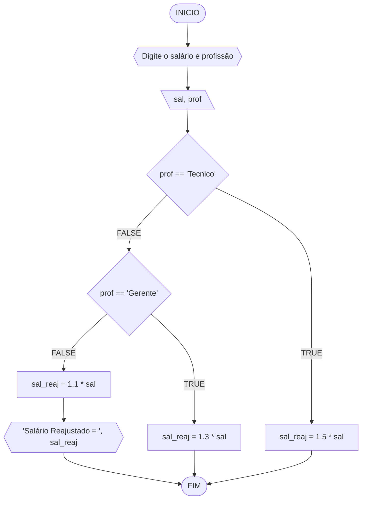
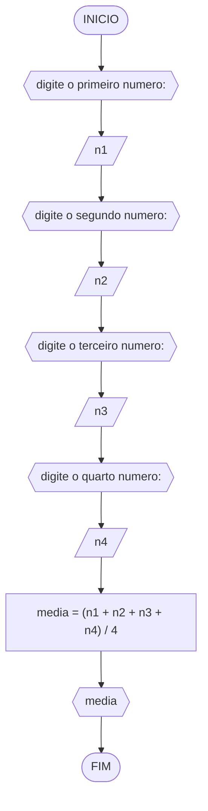
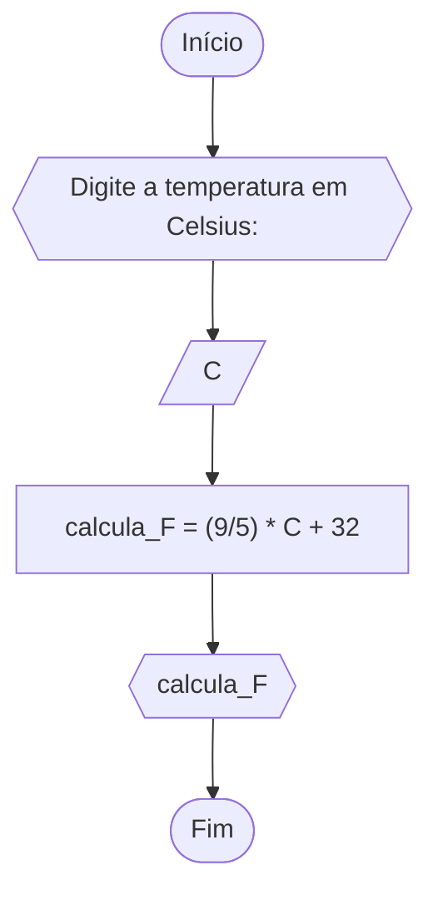
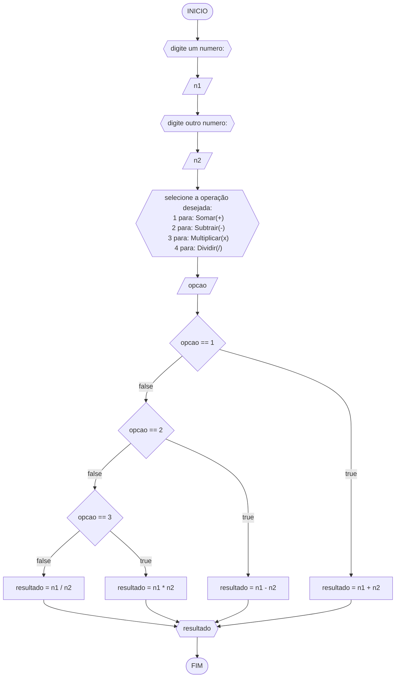
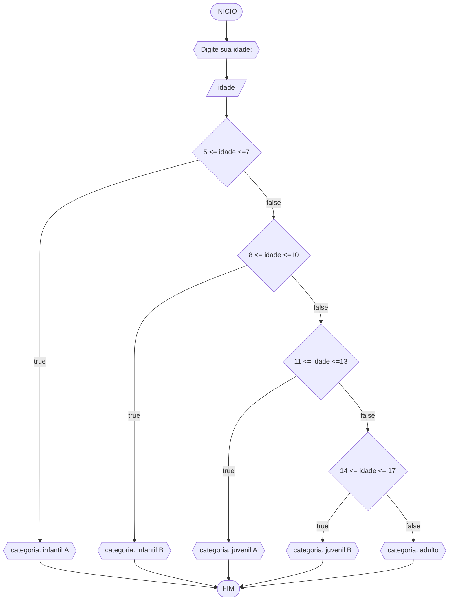

# UNIFOR
**Nome**: Nome do estudante <br>
**Disciplina**: Raciocínio lógico algorítm

## Exercício exemplo
Represente, em fluxograma e pseudocódigo, um algoritmo para calcular o adicional de salário de funcionário por cargo de uma empresa fictícia. Sabe-se que os funcionários de cargo técnico receberão reajuste de 50%, cargo de gerência, um reajuste de 30% e demais, um reajuste de 10%. 

#### Fluxograma


#### Pseudocódigo
```
1  ALGORITMO calReajuste
2  DECLARE  sal, sal_reaj: real, prof: caractere
3  INICIO
4  LEIA sal, prof
5  ESCOLHA
6   CASO prof == “Técnico”		// caso 1
7     sal_reaj ← 1.5 * sal
8   CASO prof = “Gerente”		// caso 2
9     sal_reaj ← 1.3 * sal
10  SENÃO
11    sal_reaj ← 1.1 * sal
12 FIM_ESCOLHA
13 ESCREVA “Salário Reajustado = “, sal_reaj
14 FIM
```

#### Teste
| sal | prof | prof == “Técnico” | prof = “Gerente” | sal_reaj | Saída |
| -- | -- | -- | -- | -- | -- |
| 1000 | Técnico | V | F | 1500 | “Salário Reajustado = 1500“ |
| 2000 | Gerente | F | V | 2600 | “Salário Reajustado = 2600“ |
| 9000 | Diretor | F | F | 9900 | “Salário Reajustado = 9900“ |

## Lista de exercícios 02

### Exercício 01 (2.5 pontos)
Calcule a média de quatro números inteiros dados.

#### Fluxograma (1.0 ponto)



#### Pseudocódigo (1.0 ponto)

```
Algoritmo Media
DECLARAR n1, n2, n3, n4: INTEIRO , media: REAL
INICIAR
ESCREVER "digite o primeiro numero: "
LEIA n1
ESCREVER "digite o segundo numero: "
LEIA n2
ESCREVER "digite o terceiro numero: "
LEIA n3
ESCREVER "digite o quarto numero: "
LEIA n4
media = (n1 + n2 + n3 + n4) / 4
ESCREVER media
FIM
```

#### Teste de mesa (0.5 ponto)

| Entrada1 | Entrada2 | Entrada3 | Entrada4 |  Saída   | 
|    --    |    --    |    --    |    --    |    --    | 
|    13    |    24    |    30    |   120    |  46.75   |
|    10    |    20    |    30    |    40    |   25.0   |

### Exercício 02 (2.5 pontos)
Leia uma temperatura dada em Celsius (C) e imprima o equivalente em Fahrenheit (F). (Fórmula de conversão: F = (9/5) * C + 32)

#### Fluxograma (1.0 ponto)



#### Pseudocódigo (1.0 ponto)

```
Algoritmo ConverteCelsiusFarenheit
DECLARE C, calculo_F: REAL
INICIAR
ESCREVA DigitCIOus: 
LEIA C
calcula_F = (9/5) * C + 32
ESCREVA calcula_F
FIM
```

#### Teste de mesa (0.5 ponto)

| Entrada | Saída |
|    -    |   -   |
|   10    | 50.0  |
|   36    | 96.8  |

### Exercício 03 (2.5 pontos)
Receba dois números reais e um operador e efetue a operação correspondente com os valores recebidos (operandos). 
O algoritmo deve retornar o resultado da operação selecionada simulando todas as operações de uma calculadora simples.

#### Fluxograma (1.0 ponto)



#### Pseudocódigo (1.0 ponto)

```
Algoritmo Calculadora
DECLARAR n1, n2, opcao, resultado: REAL
INICIAR
ESCREVER "digite um numero:"
LEIA n1
ESCREVER "digite outro numero:"
LEIA n2
ESCREVER "selecione a operação desejada:\n 1 para: Somar(+)\n 2 para: Subtrair(-)\n 3 para: Multiplicar(x)\n 4 para: Dividir(/)"
LEIA opcao
SE opcao == 1 ENTAO
	resultado = n1 + n2
SENAO SE opcao == 2 ENTAO
	resultado = n1 - n2
SENAO SE opcao == 3 ENTAO
	resultado = n1 * n2
SENAO
	resultado = n1 / n2

ESCREVER resultado
FIM
```

#### Teste de mesa (0.5 ponto)

| Entrada1 | Entrada2 | Entrada3 | Saída |
|    --    |    --    |    --    |   -   | 
|    5     |    5     |    1     |  10   |
|    5     |    5     |    2     |   0   |
|    5     |    5     |    3     |  25   |
|    5     |    5     |    4     |   1   |

### Exercício 04 (2.5 pontos)
Elaborar um algoritmo que, dada a idade, classifique nas categorias: infantil A (5 - 7 anos), infantil B (8 -10 anos), juvenil A (11 - 13 anos), juvenil B (14 -17 anos) e adulto (maiores que 18 anos).

#### Fluxograma (1.0 ponto)



#### Pseudocódigo (1.0 ponto)

```
Algoritmo ClassificaCategoria
DECLARAR idade: INTEIRO
INICIAR
ESCREVER "Digite sua idade:"
LEIA idade
SE 5 <= idade <=7 ENTAO
	ESCREVER "categoria: infantil A"
SENAO SE 8 <= idade <=10 ENTAO
	ESCREVER "categoria: infantil B"
SENAO SE 11 <= idade <=13 ENTAO
	ESCREVER "categoria: infantil B"
SENAO SE 14 <= idade <=17 ENTAO
	ESCREVER "categoria: juvenil B"
SENÃO
	ESCREVER "categoria: adulto"
FIM
```

#### Teste de mesa (0.5 ponto)

|Entrada| Saída |
|  --   |  --   |
| 15    | categoria: juvenil B|
| 20    |  categoria: adulto  |
